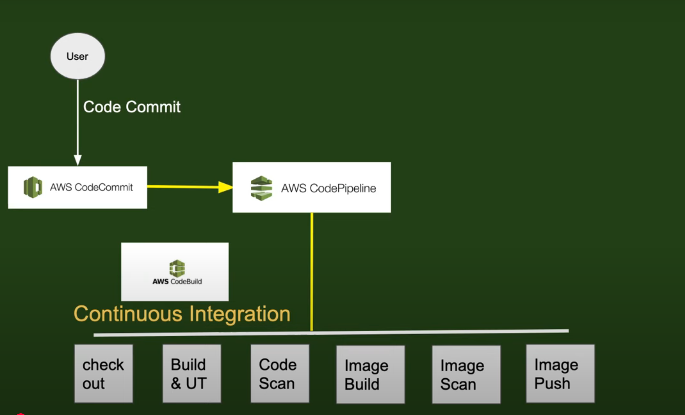

# 🚀 AWS CI/CD Pipeline Project

This project demonstrates a complete CI/CD pipeline on AWS using the AWS Console UI.

## 🛠 Services Used
- **AWS CodeCommit** – Version control for source code
- **AWS CodePipeline** – Orchestration of CI/CD flow
- **AWS CodeBuild** – Compilation, testing, image building, and scanning
- **AWS CodeDeploy** – Deployment to EC2/ECS/other environments

## 🧩 Pipeline Stages
1. **Code Commit** → Trigger via AWS CodeCommit
2. **Checkout & Build** → Performed via AWS CodeBuild
3. **Code Scanning** – Security & quality check
4. **Image Build & Scan** – Container image creation and security scan
5. **Image Push** – Push to ECR (or Docker Hub)
6. **Deploy** – Using AWS CodeDeploy

## 🖼 Architecture Diagram

## 📄 Files
- `buildspec.yml`: Instructions for CodeBuild
- `appspec.yml`: Used for CodeDeploy (optional)
- `scripts/`: Deployment and testing helper scripts

---

## 🌐 Deployment

> This project was deployed using the AWS Console UI. Infrastructure as Code (IaC) like CloudFormation or Terraform will be added in the next version.
